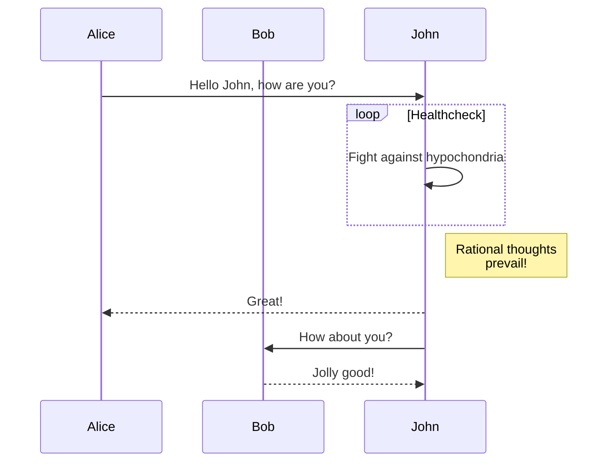
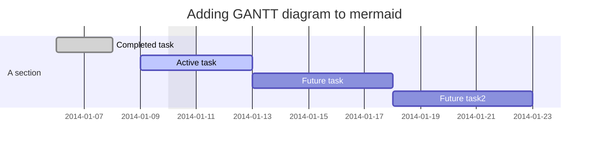
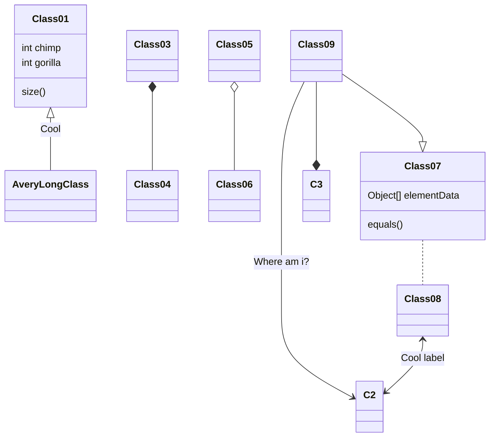
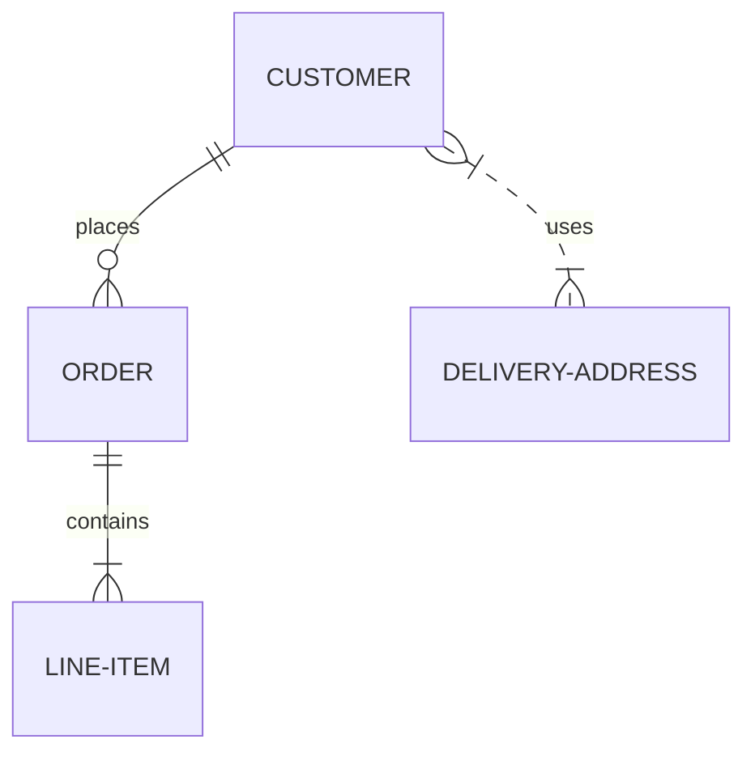

Introduction
===============================

Using AWS, you will gain the control and confidence you need to securely run your business with the most flexible and secure cloud computing environment available today. As an AWS customer, you will benefit from AWS data centers and a network architected to protect your information, identities, applications, and devices. With AWS, you can improve your ability to meet core security and compliance requirements, such as data locality, protection, and confidentiality with our comprehensive services and features.

## Sequence Graph

## Gnatt Diagram

## Class Diagram

## Git Graph

## Entity Relationship Diagram

